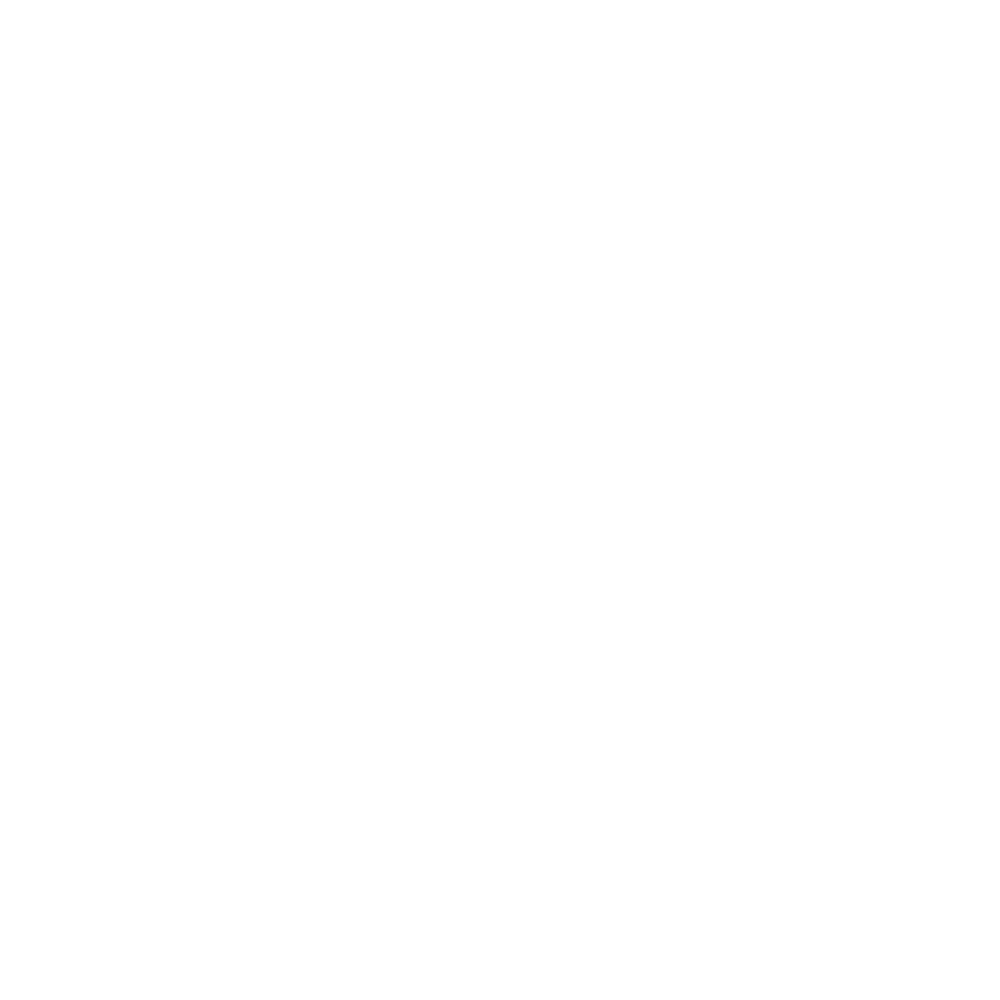
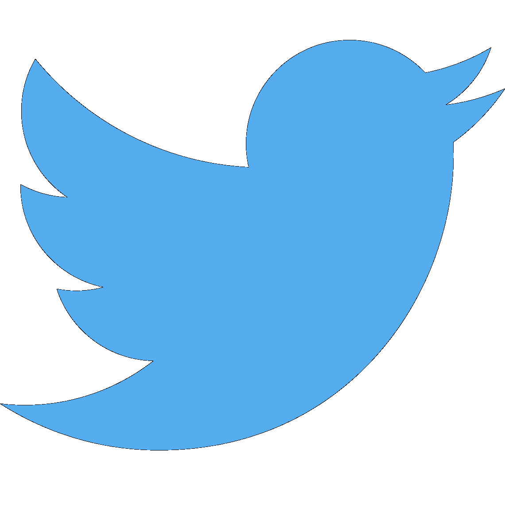
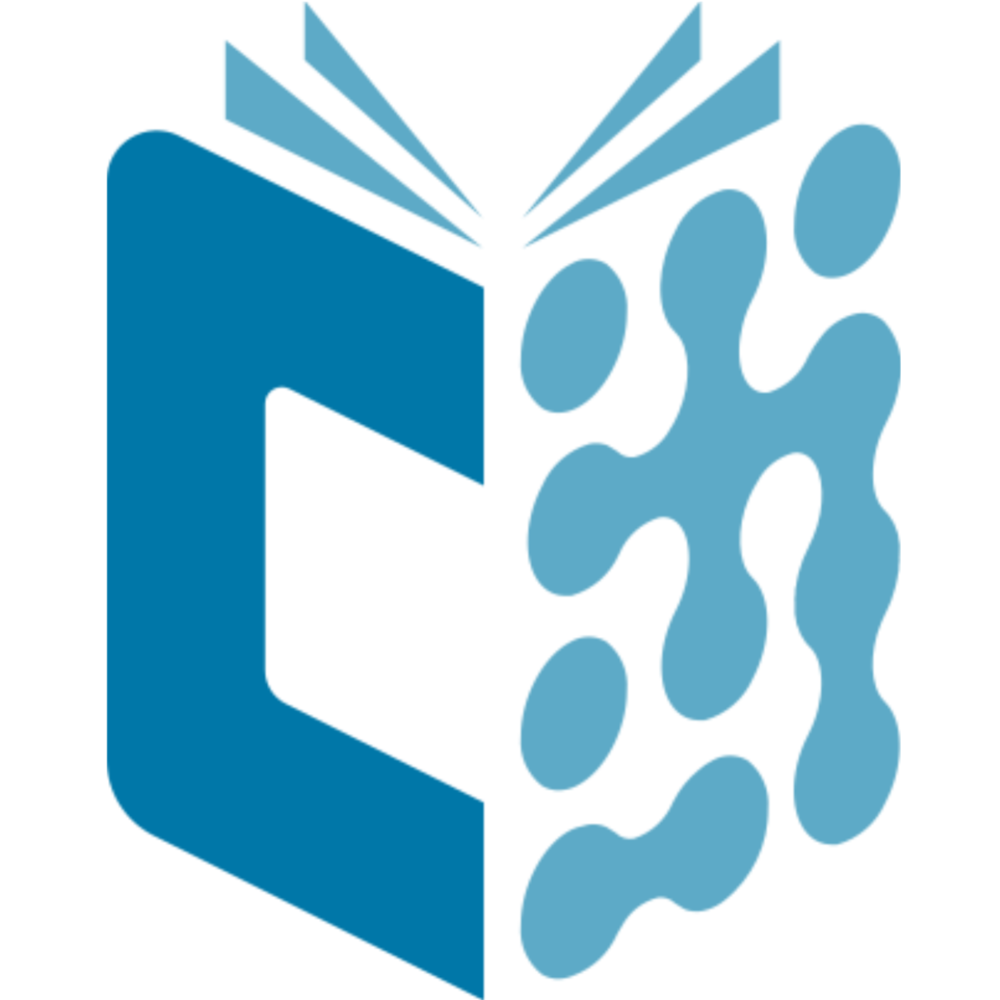
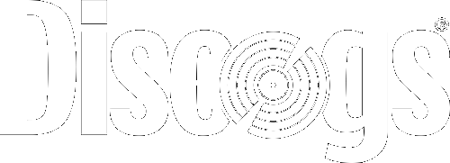

Hi there! I'm Miha
=================================================================

I'm a young and curious guy trying to learn new things
-----------------------------------------------------------------

🏫 Sophomore of Bioinformatics at University of Primosrka  
🏓 My main hobies are photography, cycling and collecting vinyl records  
📧 Contact me here: [eMail](mailto:rvkrexzat@mozmail.com)  
💻 My webpage: <a href="https://mihaprajs.github.io">mihaprajs.github.io</a>

### Skills
1. Currently learning:
    * Programming languages:
      - Java,
      - Bash,
      - R
    * Nature science:
      - Genetics,
      - Organic chemistry and biochemistry
      - Biomolecular modeling - analysis of proiteins
      - Nucleotide sequence analysis
    * Also learning lots of mathematics
2. Skills from high school (Graduated at [Biotechnical Educational Centre Ljubljna](https://www.bic-lj.si/biotechnical-educational-centre-ljubljana)):
    * Biotehcnology,
    * Basic knowledge of laboratory equipment usage

### Badges

### Other links

  
  
  
   
  

<!--
**mihaprajs/mihaprajs** is a ✨ _special_ ✨ repository because its `README.md` (this file) appears on your GitHub profile.

Here are some ideas to get you started:

- 🔭 I’m currently working on ...
- 🌱 I’m currently learning ...
- 👯 I’m looking to collaborate on ...
- 🤔 I’m looking for help with ...
- 💬 Ask me about ...
- 📫 How to reach me: ...
- 😄 Pronouns: ...
- ⚡ Fun fact: ...
-->